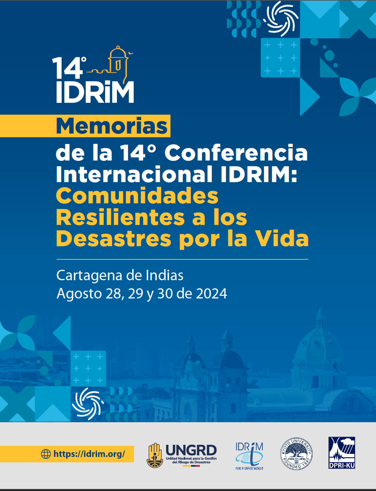

{fig-align="center" width="60%"}

## Acerca de estas memorias

Este libro recopila las memorias de la **14° Conferencia Internacional de la Sociedad Internacional para la Gestión Integrada del Riesgo de Desastres (IDRiM)**, celebrada del 28 al 30 de agosto de 2024 en Bogotá, Colombia, bajo el lema *"Comunidades Resilientes a los Desastres por la Vida"*.

La conferencia fue organizada por la **Unidad Nacional para la Gestión del Riesgo de Desastres (UNGRD)**, la **Sociedad Internacional para la Gestión Integrada del Riesgo de Desastres (IDRiM)** y la **Universidad de Kioto — Instituto de Investigación para la Prevención de Desastres (DPRI)**.
